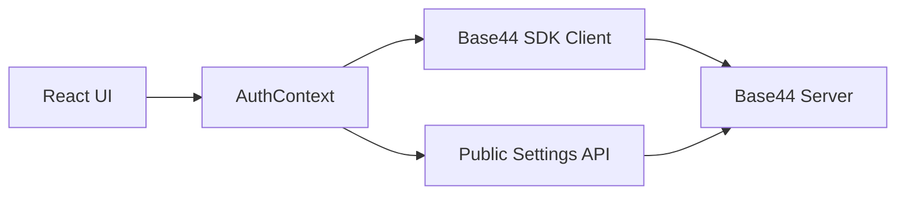
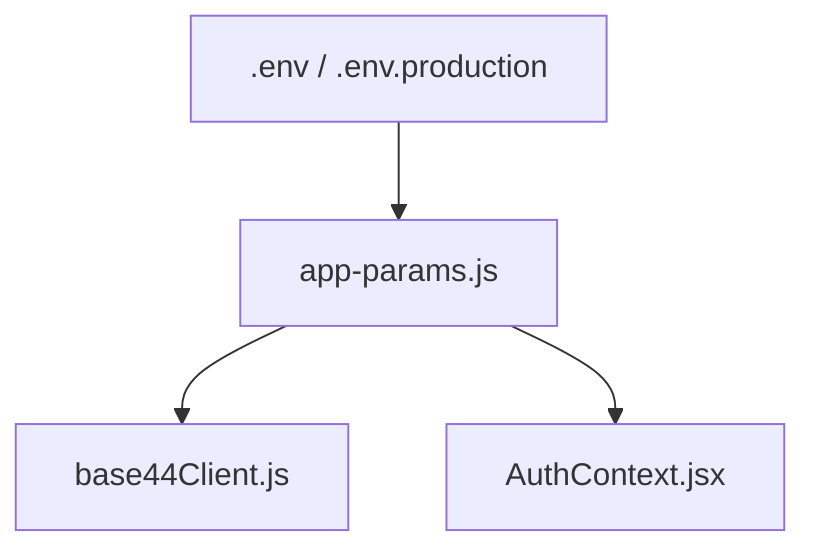

# Architecture Overview

## Summary
Abide & Anchor is a React + Vite single-page application that uses the Base44 SDK for data, auth, and analytics. The app is packaged for iOS via Capacitor. The Base44 App ID and server URLs are provided at build time via Vite environment variables.

## Core Components
- `src/lib/app-params.js` - Resolves and validates Base44 configuration.
- `src/api/base44Client.js` - Creates the Base44 SDK client.
- `src/context/AuthContext.jsx` - App-level auth and onboarding state.

## Request Flow

## Configuration Flow

## Security Considerations
- Do not commit real API keys or App IDs.
- Use `.env.production` for iOS builds; values are baked at build time.
- The client only uses user-level tokens; service tokens must never be used in the frontend.

## Operational Notes
- When `appId` is missing, the app prevents API calls and reports configuration issues.
- `serverUrl` is always absolute, preventing requests from falling back to `capacitor://localhost`.
